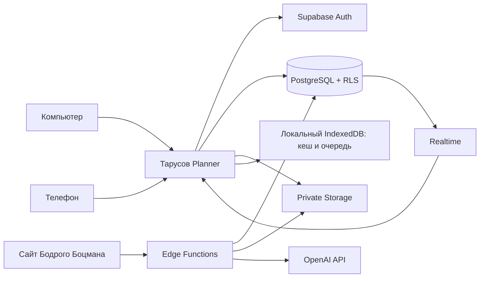

# Облачное хранение для «Тарусов Planner»

## Цель

Перевести сайт с хранения только в браузере на единое рабочее пространство, которое одинаково открывается на компьютере и телефоне. Фотограф редактирует проекты и материалы, директор просматривает, комментирует и согласовывает. Потеря или смена устройства не должна приводить к потере данных.

## Выбранная основа

**Supabase**:

- PostgreSQL — организации, лодки, темы, сцены, публикации и согласования;
- Auth — вход по электронной почте и управление сессиями;
- Storage — фотографии, видео, раскадровки и документы;
- Realtime — обновление открытого проекта у фотографа и директора;
- Edge Functions — AI-сценарии, уведомления и будущая интеграция с сайтом «Бодрого Боцмана».

Клиент использует только publishable key. Secret/service role key хранится только на сервере: он обходит RLS и не должен попадать в браузер.

## Общая схема

## Роли

| Роль | Возможности |
|---|---|
| Владелец | Управление организацией, пользователями, всеми проектами и настройками |
| Фотограф | Создание и редактирование тем, сценариев, сцен, дат, публикаций и файлов |
| Директор | Просмотр проектов, комментарии, «Согласовать» и «Нужны правки» |
| Наблюдатель | Только просмотр выбранных проектов; можно добавить позже |

Один пользователь может иметь разные роли в разных организациях.

## Структура данных

Все основные записи используют UUID, `created_at`, `updated_at`, `created_by`, `updated_by`, `version` и необязательный `deleted_at` для безопасного удаления и синхронизации.

### Пользователи и доступ

- `profiles`: имя и настройки пользователя; связь с `auth.users`.
- `organizations`: организация, например «Бодрый Боцман».
- `organization_members`: пользователь, организация, роль, статус приглашения.
- `project_members`: необязательное ограничение пользователя конкретными лодками.

### Проекты и работы

- `projects`: одна лодка или катер — один проект; организация, название, описание, этап, цвет, архив.
- `project_works`: работы по проекту; тип работы, описание, этап, сроки, статус, внешний ID.
- `integration_links`: связь проекта и работы с объектами сайта «Бодрого Боцмана».

### Контент-план

- `topics`: тема контента; проект, рубрика, общий замысел, сценарий, статус согласования.
- `topic_work_links`: связь темы с несколькими работами проекта.
- `scenes`: сцена; порядок, тайминг, план, действие, речь, закадровый текст, дата съёмки, крайний срок, статус, признак «до начала работ».
- `publication_variants`: площадка, формат, текст, дата, готовность, ссылка на опубликованный материал.
- `preparation_items`: чек-лист подготовки темы или съёмки.
- `folders` и `topic_folders`: папки без изменения основной структуры темы.

### Согласование

- `approval_requests`: тема или публикация, автор запроса, директор, текущий статус.
- `approval_comments`: комментарий, автор, дата и привязка к версии материала.
- `activity_log`: кто и когда изменил дату, сценарий, сцену, публикацию или решение.

Статусы согласования: `draft`, `pending`, `changes_requested`, `approved`. После изменения уже согласованного материала статус возвращается в `draft`.

### Файлы

- `media_assets`: метаданные файла, проект, тема, сцена, публикация, владелец, тип, размер, длительность, статус загрузки.
- Закрытый bucket `project-media`.
- Путь: `{organization_id}/{project_id}/{topic_id}/{scene_id}/{uuid}.{ext}`.
- Просмотр и скачивание выполняются через короткоживущие signed URL.
- В базе не хранятся Base64-файлы.

## Правила доступа RLS

RLS включается для каждой таблицы и для `storage.objects`.

- Пользователь читает данные только организаций, где есть активная запись в `organization_members`.
- Владелец управляет участниками и всей организацией.
- Фотограф создаёт и изменяет проекты, темы, сцены, публикации и файлы.
- Директор читает материалы, создаёт комментарии и меняет только статус согласования.
- Наблюдатель имеет только `SELECT`.
- Запись нельзя перенести в другую организацию изменением `organization_id`.
- Storage проверяет организацию и проект из пути объекта через RLS.

Права нужно тестировать отдельно для каждой роли. Таблица в открытой схеме без RLS считается ошибкой сборки.

## Синхронизация и работа без сети

IndexedDB остаётся как локальный кеш, но перестаёт быть единственным источником данных.

1. При входе загружается изменённое после последней синхронизации.
2. Изменения сначала сохраняются локально в `outbox`, интерфейс продолжает работать.
3. При появлении сети очередь отправляется в облако.
4. Запись обновляется только при совпадении `version`.
5. При конфликте пользователь видит две версии и выбирает сохранённую.
6. Realtime сообщает об изменениях директора или второго устройства.
7. Удаления передаются через `deleted_at`, затем очищаются отдельной задачей после периода восстановления.

Индикатор в шапке: «Сохранено в облаке», «Нет сети — 3 изменения ожидают», «Нужна проверка конфликта».

## Миграция существующих данных

1. Перед миграцией скачать текущий JSON-экспорт.
2. Создать организацию и пользователя-владельца.
3. Импортировать проекты, темы, сцены и публикации с сохранением текущих UUID.
4. Файлы из Base64 загрузить в Storage, а в записях заменить содержимое на `media_asset_id`.
5. Сравнить количество проектов, тем, сцен, публикаций и файлов.
6. Переключить приложение на облачный источник.
7. Сохранить исходный экспорт как резервную копию.

Импорт должен быть повторяемым и не создавать дубликаты.

## Серверные функции

- `generate-scenario`: принимает проверенные вводные и вызывает OpenAI API; ключ хранится только в секретах функции.
- `bodr-webhook`: принимает подписанные события о лодках и работах.
- `send-reminders`: формирует напоминания о съёмках, дедлайнах и согласовании.
- `create-review-link`: создаёт ограниченную ссылку для просмотра конкретной темы, если понадобится доступ без аккаунта.

## Резервные копии и аудит

- Версионные миграции базы хранятся в `supabase/migrations` в GitHub.
- Ежедневная резервная копия базы и периодическая проверка восстановления.
- Медиа хранятся отдельно от БД; удаление сначала мягкое.
- JSON-экспорт остаётся доступным владельцу.
- `activity_log` хранит важные изменения и решения по согласованию.
- Ошибки синхронизации и функций записываются без токенов, паролей и содержимого приватных файлов.

## Этапы внедрения

Для безопасного перехода используется промежуточная таблица `workspace_snapshots`: она хранит снимок только одной организации и защищена теми же ролями и RLS. Это позволяет сначала синхронизировать текущий сайт без полной переделки экранов, а затем по очереди перевести проекты, темы, сцены и публикации в нормализованные таблицы. Снимок не заменяет целевую структуру и удаляется после завершения миграции.

### Этап 1. Основа

- Supabase Auth;
- организации, участники, проекты и темы;
- RLS;
- синхронизация IndexedDB ↔ PostgreSQL;
- миграция текущего JSON;
- индикатор состояния синхронизации.

Результат: один аккаунт и одинаковые данные на компьютере и телефоне.

### Этап 2. Совместная работа

- роли фотографа и директора;
- согласование и комментарии;
- история изменений;
- Realtime.

Результат: обсуждение и решения происходят внутри проекта.

### Этап 3. Медиа

- private Storage;
- загрузка кадров с телефона;
- привязка файлов к сценам;
- миниатюры, прогресс загрузки, повтор после обрыва сети.

Результат: режим «На съёмке» хранит реальные дубли и заметки.

### Этап 4. Интеграции

- OpenAI через Edge Function;
- интеграция с сайтом «Бодрого Боцмана»;
- напоминания;
- отчёт по готовности проекта.

## Критерии готовности первого этапа

- Два устройства одновременно видят один проект.
- После обновления страницы данные не теряются.
- Фотограф может редактировать, директор не может менять сценарий.
- Директор может оставить комментарий и согласовать.
- Пользователь другой организации не может получить данные даже прямым API-запросом.
- Работа без сети сохраняет изменения и отправляет их после восстановления соединения.
- Старый JSON импортируется без потери связей.
- Service role key и OpenAI API key отсутствуют в HTML, JavaScript и истории Git.
